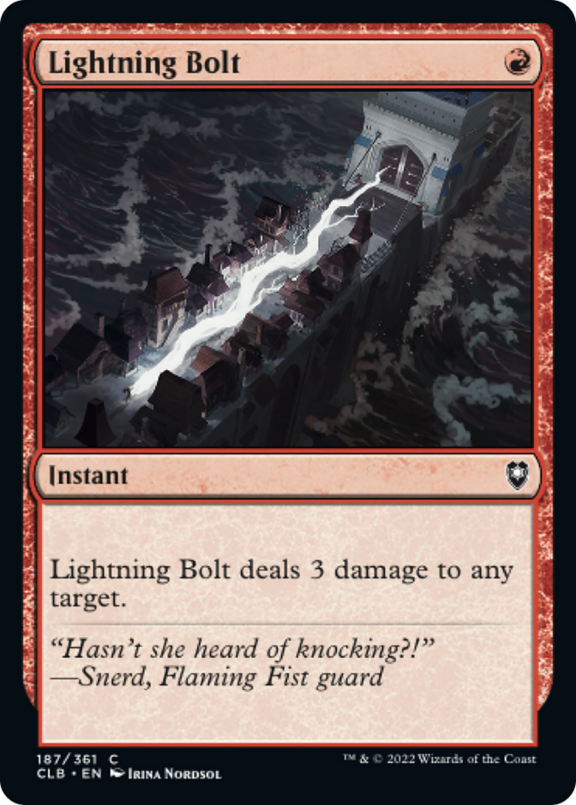
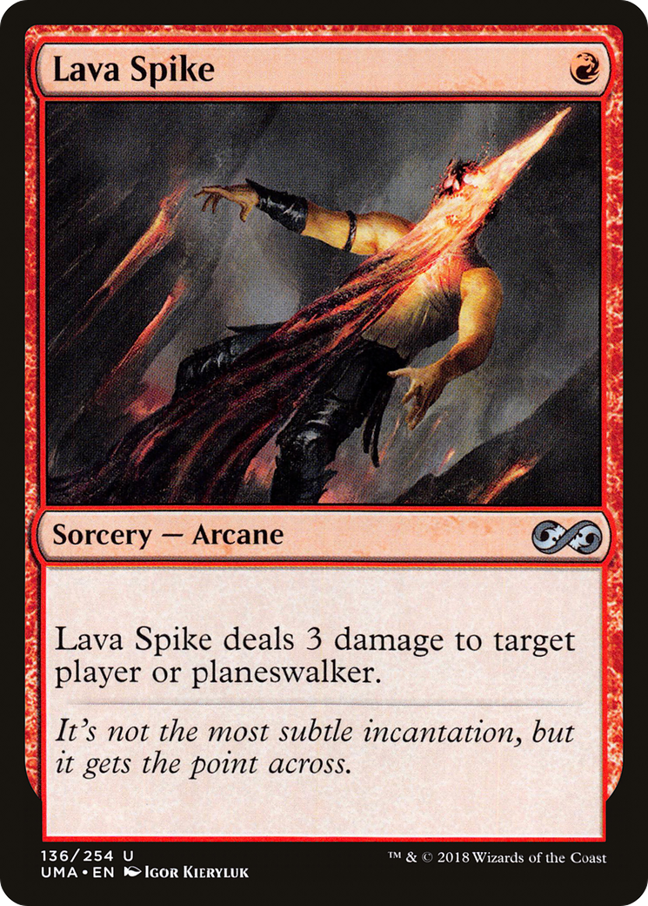
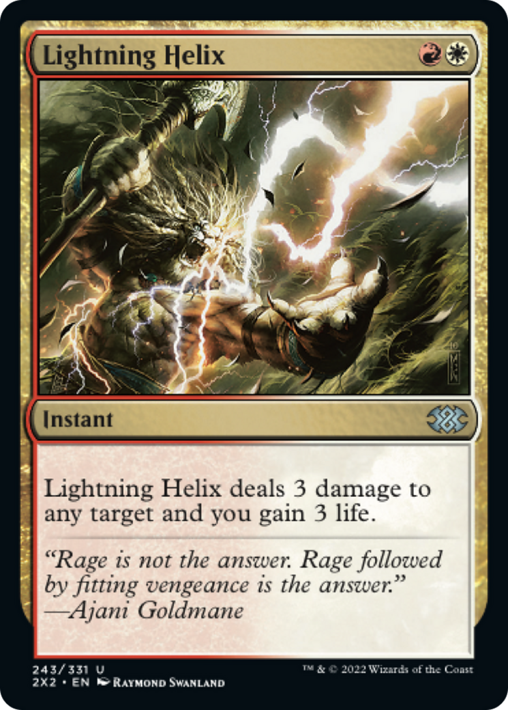
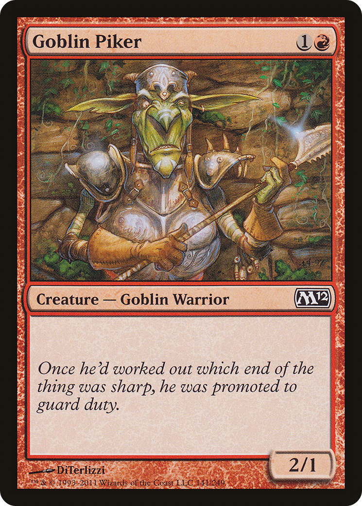
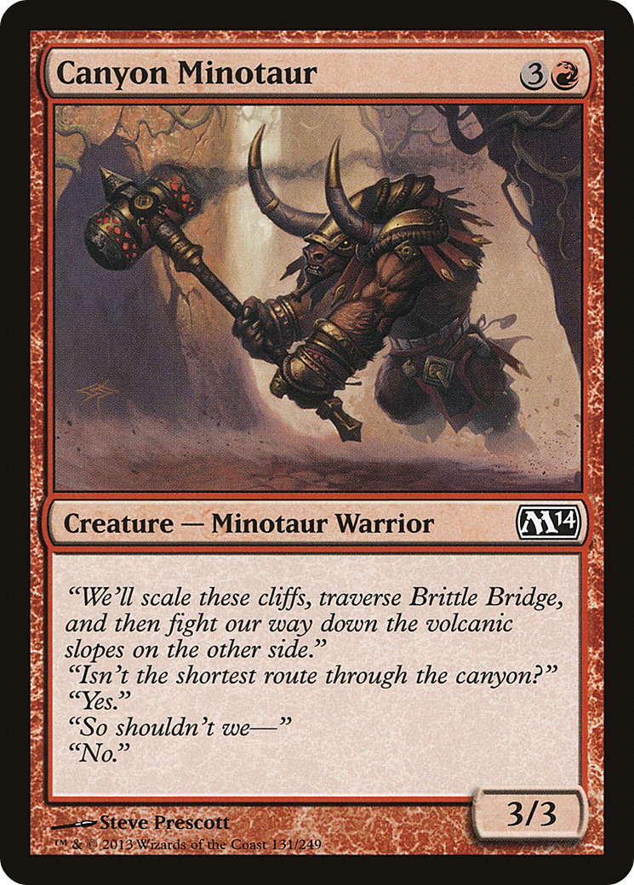
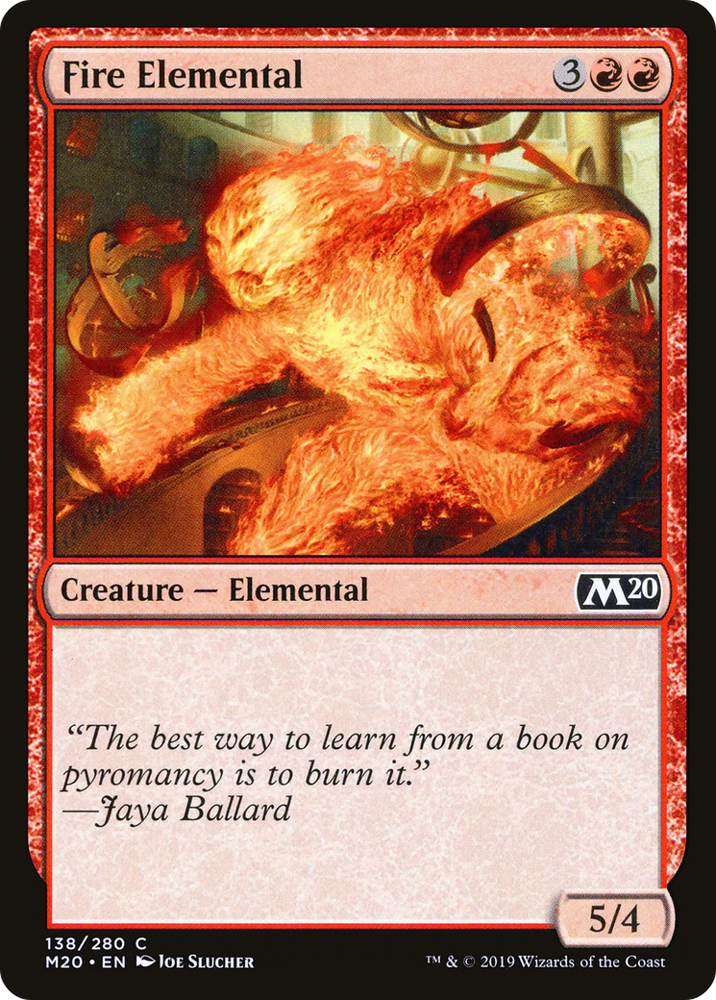
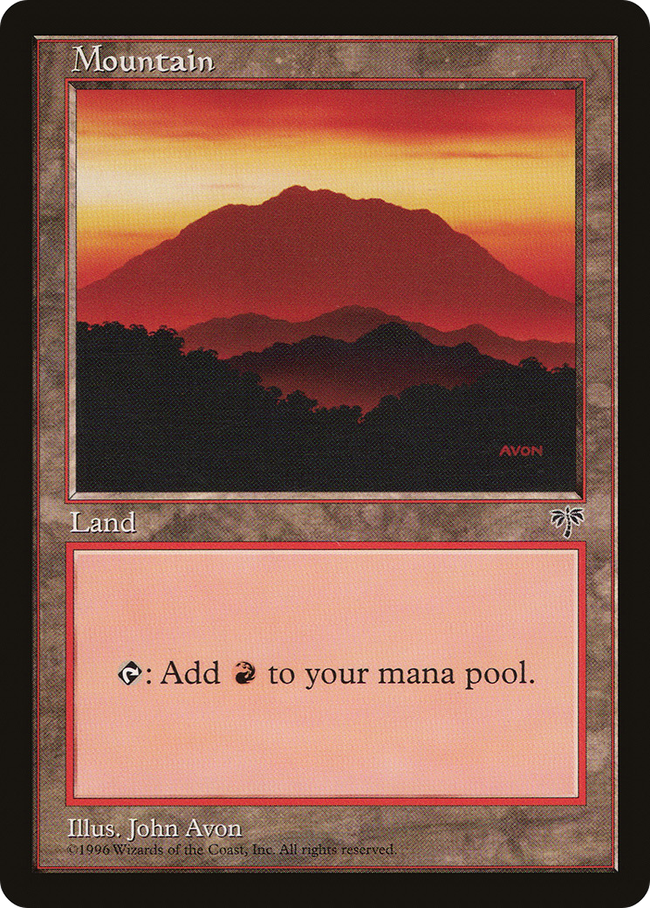
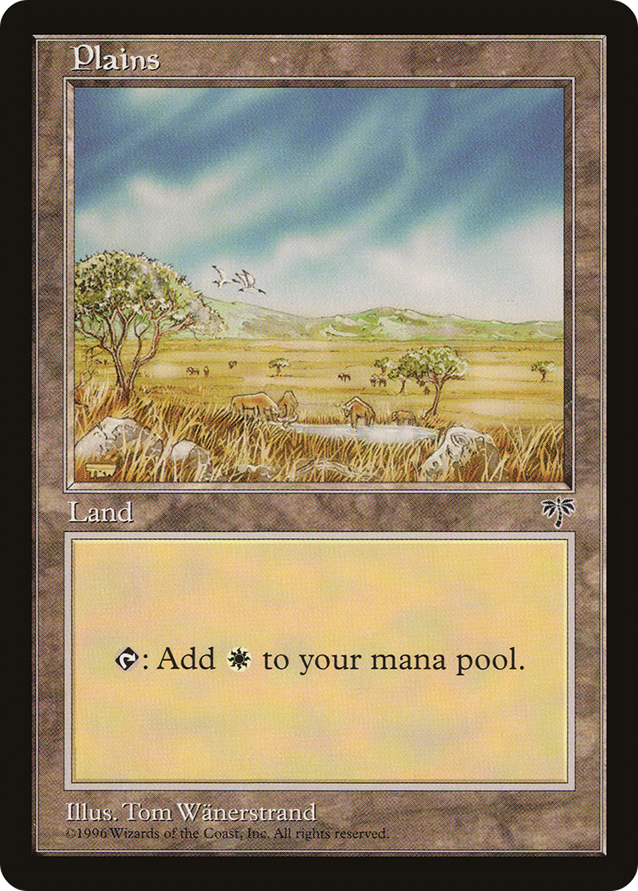
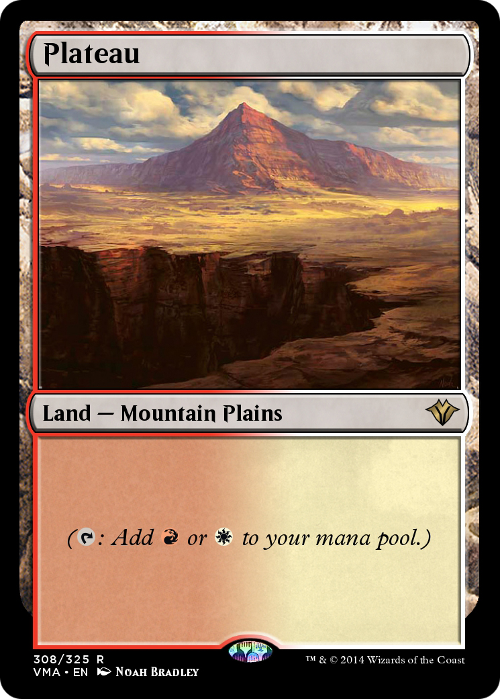
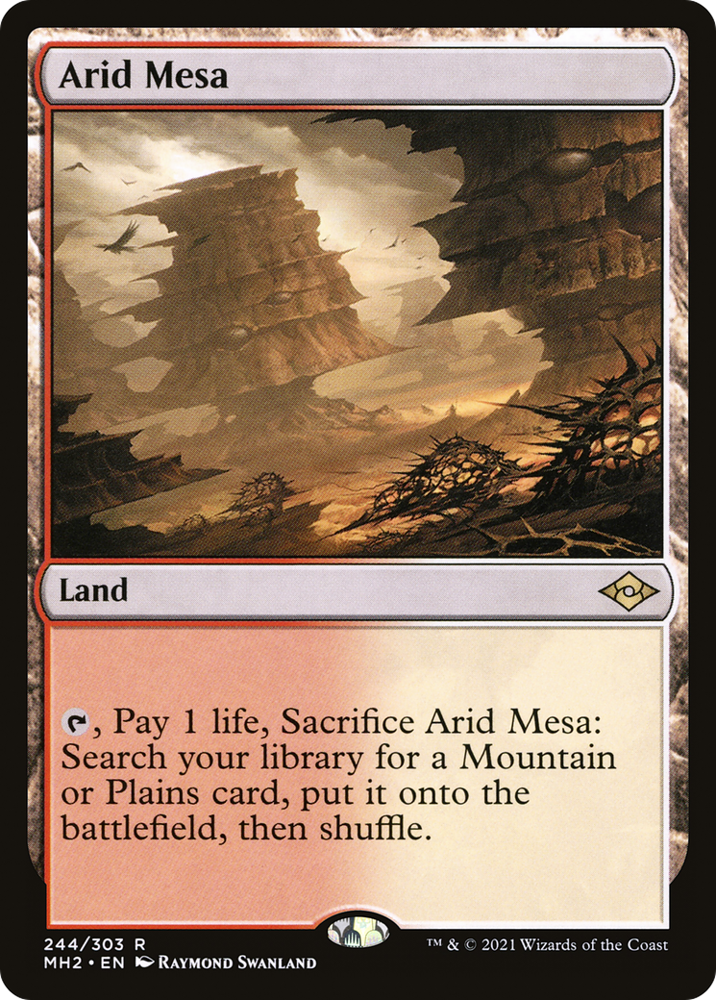

[//]: # (credit: card images obtained from Scryfall.com         &#41;)

#Crash Course Magic
This is a quick crash course in how to play Magic: The Gathering, for people who are unfamiliar with the game. Please note that some 
statements below are generalizations, and aren't always true in every game of Magic in real life played against real people. 
However, they're always accurate for how my program works.

Magic: The Gathering is a tabletop card game. Each player starts at 20 life and tries to bring the other player down to 0 as quickly as possible.
They do this by playing many variants of cards, including creatures, lands, instants and sorceries. There are five colors of mana: white,
blue, black, red, and green. There is also 'generic' mana, which can be paid for with any color. 
Within my program, however, I only use two colors: red and white, as well as generic mana. I go into more detail on mana later.

###Quick overview of game zones
Magic has lots of fancy names for mundane card game zones. I always use the Magic term rather than the mundane one.

Library: your draw pile. (not any sort of C++ or programming library)  
Graveyard: your discard pile. Oneshots are put here when you play them.  
Battlefield: all the cards that you have played and are sitting on the (metaphorical) table. Creatures and lands go here when you play them.
The battlefield is split into two objects: one for creatures, and one for lands.

##Card types
There are many different card types in Magic, such as creatures, lands, instants, sorcieries, enchantments, artifacts, and more.
However, in my program, we only deal with creatures, lands, instants and sorceries.

###Oneshots

Two types of cards in Magic are instants and sorceries. Both card types have a one-time effect when played, and then are discarded.
The only difference between an instant and a sorcery is when you can play it.
You can play an instant at any time, but you can only play sorceries on your turn. This is a very important distinction when playing against
a real player. For example, if you had a "destroy an enemy creature" instant, you could save it for the end of an opponent's turn,
in case they play something you want to remove. You couldn't do this if the card was a sorcery.
However, when playing against an opponent that doesn't exist, the distinction doesn't matter at all, 
since there's no reason to wait to play your spells. This simplifies many things. 

Within my program and documentation, I generally refer to both instants and sorcieries as "oneshots", because they both have a one-time
effect and then are immediately discarded, and since there's no reason to wait to play them, they can be used interchangeably.

###Creatures

Another type of card is called a creature. Unlike oneshots, they stay on the table ("battlefield") when you play them.
Creatures have a power and toughness, noted on the bottom-right of the card. The first number is power, and the second number is toughness.
For example, Raptor Companion has a power of 5 and a toughness of 4, and Goblin Piker has a power of 2 and a toughness of 1.
Power and toughness can be thought of as damage and health, respectively. Once per turn,
all of your creatures deal damage equal to their power to your opponent.
Toughness is irrelevant in my program because your creatures aren't taking any damage. Note that none of these creatures in the images above
are actually in any of my decks. I chose these because they don't have any special abilities, are easier to understand, 
and I liked the flavor text.

###Lands

There are two main types of cards in Magic: lands and nonlands. "Nonland" is a catch-all for any card that isn't a land, and so could be
a creature, oneshot, etc. Lands are what you use to pay for your nonland cards. 
Each turn, a land produces one mana that you can use to pay for spells' mana costs.
(Note: a 'spell' is any card that isn't a land. To simply things, I've tried to instead say 'nonland' in call places I'd say 'spells,' 
but I've probably missed a few instances and left in the term 'spell,' so it's good to know.)
Each land can tap for one or more colors of mana. Plains tap for white mana, Mountains for red, and Plateaus for either white or red.
I go into more details on mana costs in the next section. Lands don't have mana costs, but you're limited to playing one land per turn.

There are also many lands that do random, complicated things, but the only one of those we'll use is Arid Mesa, which is called a "fetch land." 
They don't produce any mana on their own, but they allow you to search your 
library for a land of your choice (_fetch_ that land) and play it for free.

Within my program, I refer to "fetches" and "duals" a lot. In every single case where I say "dual" or "fetch,"
I'm referring to a Plateau or Arid Mesa, respectively.

You can play as many oneshots and creatures you want, as long as you have the mana, but you can only play one land per turn. In Magic,
you should play your land every turn. If you don't have a land in your hand and can't play a land, this is known as "missing your land drop."
If this happens on your first turn, it's even worse, and is known as "missing your Turn 1 land drop." I have two stats dedicated to these. One 
increments for every turn you don't play a land, and the other one is either a 0 or a 1 depending on whether you played a land on your first turn.
This is to help keep track of how balanced your land-to-nonland ratio is.

##Mana costs

This is one of the most important gameplay aspects of Magic, and it is crucial to understand this to fully understand how my program works.
Each nonland card in Magic has a mana cost associated with it. This is located in the top right of the card. There are generally two aspects
to a mana cost: generic mana and colored mana. Generic mana is represented by a number in a gray circle. 
Colored mana is represented by a dot (called a "pip") of the respective color. For example, the card 'Goblin Piker' has a mana 
cost of one generic mana and one red mana. Lightning Helix has a cost of one red and one white mana, and has no generic mana cost.
Lightning Bolt has a cost of just one red mana.

There's also a term called "mana value", which is the total of all generic and colored costs. 
Canyon Minotaur has a mana value of 4, Lightning Helix, 2, and for Raptor Companion, 2.

The combination of generic costs and pips are often consolidated into a string such as `2RRW` with the plaintext number representing generic
mana costs, and each 'R' representing one red pip, and each 'W' representing one white pip. Within my program, I refer to strings such as these
by the term "display cost" or "full cost". A full cost of `2RRW` has a mana value of 5, 2 generic mana, 2 red pips ane 1 white pip. 
In my program, most of the cards I use have a full cost of simply `R`, like Lightning Bolt.

More examples:  
Goblin Piker: full cost of `1R`, mana value of 2. The `1` can be paid for by any land, and the `R` needs a mountain or a dual.  
Boros Charm: full cost of `RW`, mana value of 2. Costs 1 red and 1 white.  
Fire Elemental: full cost of `3RR`, mana value of 5. Costs 3 generic and 2 red.

###Paying costs
Colored mana can only be paid for by mana of the correct color. For example, since Mountains can't produce white mana, you could not cast
Lightning Helix if your only lands are Mountains. However, if you had one Mountain and two Plains, you could cast it.
Generic mana can be paid with any color of mana. Dual lands, such as Plateau, can pay for one many of either color. So if you had two duals out,
you could pay for a cost of `RR`, `RW`, or `WW`. Each land can only produce one mana per turn. 
Once you've activated its ability, in real life, you turn the card sideways to represent
that it has already been used this turn, an action called "tapping." In my program, this is kept track of with variables. 
A tapped land can't be used further this turn. At the beginning of each turn, you "untap" everything that you tapped on the last turn,
allowing you to use it again.